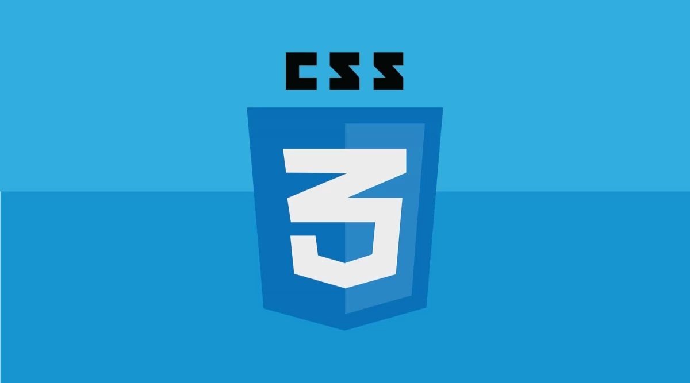

# Welcome to Manuel's Page

## EN.605.787 Front End Web App Development

The following repository contains the assignment solutions prepared by **Manuel E. Santiago Laboy**.

## Assignment Solutions:
### Assignment #1

- **Link:** [Module 2 Solution](https://manuelsanti1986.github.io/jhu-front-end-dev/module2-solution)
- **Description:** The first assigment was dedicated to learn the basics of the Cascading Style Sheets (CSS) language used to describe the presentation of an HTML document.

### Asignment Submission Reminders

1. Push up all of your work to GitHub.com. Since we wil be using GitHub pages to view the deployed assignment, make SURE to test for yourself that your assignment submission works as expected before you call it complete.
    - The first week of the first course will explain to you how to set up your GitHub account and your development environment.
    - Some of the GitHub UI has slightly changed since the videos were recorded. Be sure to check out the following 2 FAQ entries: Where is the Clone Link? and Where is the Launch Atomatic Page Generator?
2. Submit the URL to your assignment on Blackboard. You can update your submission as many times as you like before the due date. Only the latest submission will count. However, submission after the due date/time will not be considered.

**Make sure both of these are done before the due date/time. (See info below on late submissions).**

### Contact Information

- Email: manuelsanti86@gmail.com
- School Email: msanti16@jhu.edu

